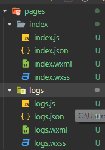
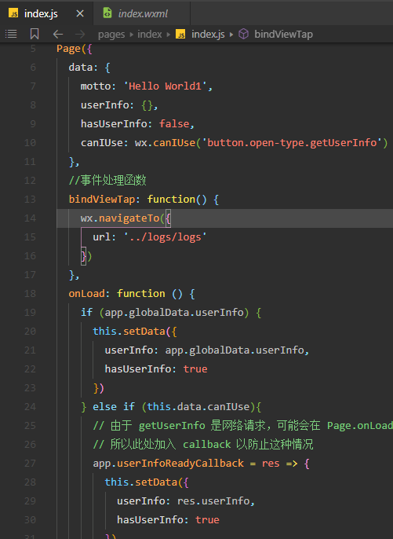

## 组件化
毫无疑问的是，小程序必然会以组件化的方式向开发者提供组件，这样的好处是维护起来更加方便，也是客户端开发的必然趋势。
众所周知，随着React、Vue等MVVM框架的兴起，web开发者也越来越多地使用组件化的方式进行开发，组件化最大的好处就是：
**组件化有利于构建大型、超大型的应用，且由于各组件之间是隔离的，有利于组件的维护。**

因此，我更加倾向于将大前端下的web开发称为web客户端开发，因为其思想已经与客户端开发无异了，只是渲染的方式与对象不同而已。说到这里，我们就需要比较一下微信小程序与web应用的组件的区别：

**微信小程序的组件是原生组件，而web应用的组件是基于html元素构建起来的web组件**

## 如何入门小程序？
小程序的基石是MVVM、组件化，因此要入门小程序，掌握组件化的思想与常见实现手段是基础，那么，客户端、MVVM框架是如何实现组件化的呢：

- 视图、数据、逻辑的隔离。
- 数据绑定。

因此，熟悉任何一个基于组件化的MVVM框架都有利于小程序的学习，在学习小程序之前，我已对Vue有一定的掌握度，因此对于模板语法、双向绑定已经很了解了，所以小程序的入门中将不再赘述。
除了MVVM思想外，还需要掌握客户端开发的基本思想，比如生命周期，组件有生命周期，页面也有生命周期，对于所有客户端开发而言生命周期都必不可少，因为一个页面的加载永远绕不开创建 - 加载 - 展示 - 隐藏 - 卸载 - 销毁这样的过程。

了解了以上的知识后，你可以对一些常见的问题与实现手段的背后原理了如指掌，比如：

#### 为什么微信小程序这么组织目录结构？

因为每个页面其实都是一个组件，而组件需要实现视图、数据、逻辑的隔离，上图中，wxml与wxss文件负责描述视图，js文件负责维护数据与逻辑，json文件则负责描述组件的配置。因此相对普通组件而言，微信小程序的页面还多了一个配置的隔离。

#### 下面的代码都是什么含义？

学过vue的对以上代码想必都不陌生，data负责维护页面组件的数据，onLoad实际上是页面加载完成的回调，这对应了页面的生命周期，bindViewTap负责处理交互。

#### 微信小程序的启动流程是怎样的？
如果你已经对客户端开发很了解了，想必你可以轻松总结出微信小程序的启动流程：
1. 小程序引擎加载app.js文件，准备启动小程序；
2. 触发onLaunch回调，应用成功启动，处理初始化工作；
3. 分析路由，加载第一个路由页面；
4. 调用路由的生命周期；
5. 页面被渲染。

与纯粹的客户端开发不一样的是，小程序保留了一些路由、页面这样的概念，而在客户端开发中他们被统一称为View（如在iOS中被称为ViewController，在Android中被称为Activity）。因而可见小程序更贴近web开发者，保留路由这样的概念实际上与web开发者对于浏览器的前进、后退的理解是不谋而合的。